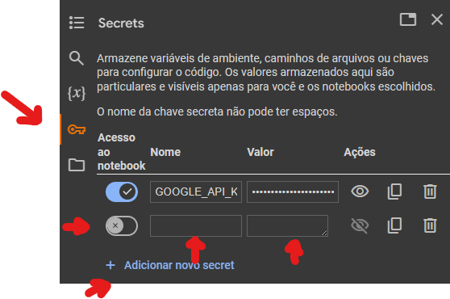

#  ResumeAI 

**Sabe aquele conteúdo com vários conceitos que você nem sabe por onde começar? Seus problemas acabaram! Com esse chatbot intuitivo e prático, você envia o pdf do conteúdo e recebe um pdf com um resumo completo e no final uma seção de perguntas e respostas para revisão !**

 

## Table of contents

[Descrição do projeto](#descrição-do-projeto)

[Instruções de Instalação](##instruções-de-instalação)

[Instruções de Uso](##instruções-de-uso)

[Exemplo de Uso](#exemplo-de-uso)

[Melhorias futuras](#melhorias-futuras)

## Descrição do projeto

* Esse projeto a partir de um pdf enviado pelo usuário o google gemini gera um resumo sobre o conteúdo com perguntas e respostas estruturado da forma de markdown, que por fim, é estruturado num pdf que o usuário pode baixar.

* Ele foi construído a partir da API do google gemini, utilizando python para acesso e cosntrução dos pdf, gerar o modelo de IA e enviar as instruções para processamento do pdf. Além disso, para facilitar o acesso, ele é executado completamente no google collab

* O principal objetivo desse projeto é agilizar e auxiliar no aprendizado das pessoas, gerando bons resumos e questões para validação do conteúdo. Além disso, como forma de democratização, o projeto foi feito completamento no collab, assim é neccessário apenas conexão com a internet para utilização do mesmo, sem precisar de uma máquina potente

## Instruções de instalação

* Como citado acima, o projeto é feito no collab, no entando temos alguns passos a fazer:
    1. Acessar o código e clicar em "Abrir no collab"

    2. Caso você não esteja logado em uma conta google, o site vai pedir para logar

    3. Gere sua API key: no arquivo tem um resumo mais completo, mas em resumo, acesse https://aistudio.google.com/app/apikey e siga o passo a passo do collab para configurar sua API key para o código funcionar

    

    4. Aperte Ctrl + F9, ou vá no menu "Ambiente de execução" -> "Executar tudo"
    

## Instruções de uso
* Para utilização, vá para última célula do colab ("Parte principal do código"), lá ele vai solicitar o pdf, basta enviar e ele vai gerar im pdf completo para você

* Por fim, o sistema pergunta se você que baixar o pdf, basta dizer sim e você tem um pdf conteudo seu resumo e questões para revisão !

## Exemplo de uso

* Para exemplificação da funcionalide do sistema, fiz um pdf do capítulo 5 (Principios de Projeto) do livro [Engenharia de Software Moderna](https://engsoftmoderna.info/)

* Na raiz do projeto é possível ver o arquivo [ResumeAI](ResumeAI.pdf) que contém o resumo gerado pelo pdf do capítulo, usando uma formatação markdown para melhor legibilidade

## Melhorias Futuras

* Como possíveis incrementações do projeto, será implementado uma interface web para facilitar a utilização do sistema

* Histórico dos pdfs gerados

* Edição nos nomes dos pdfs

---

# **
ResumeAI seu bot de auxílio nos estudos !** 

